# Final Year Project ⚡️

## Using ASR Technology To Aid Communication Between Persons With Hearing Disabilities.(Babble) 

This is a rather brief and concise description of the project 🥳

### Introduction 🚀
Babble is an iOS app that aids effective communication between hearing persons and persons with hearing disabilities.
Vast majority of normal hearing persons find it difficult to express themselves to disabled persons who uses sign languages to have conversations with others.

So, we had in mind to create Babble as a software that uses natural language processing with ARS technology to offer real-time transcription of speech from people to communicate better with other people around them 😊

Babble is also extremely valuable to anyone who needs to generate a lot of written content without a lot of manual typing.

### Note ⚙️
The application was built using: 
* Xcode 12.5.1
* Swift 5.4
* macOS Big Sur 11.5.2
* MVC Pattern

### Core Technologies 📲
* Swift
* Firebase/firestore
* GoogleSignIn
* googleapis
* Persistence with Core Data

# Screenshots

## Onboarding Screens
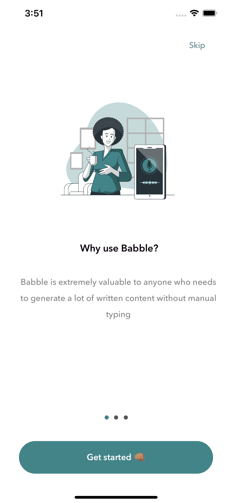

## Authentication Screens

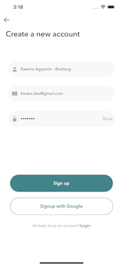
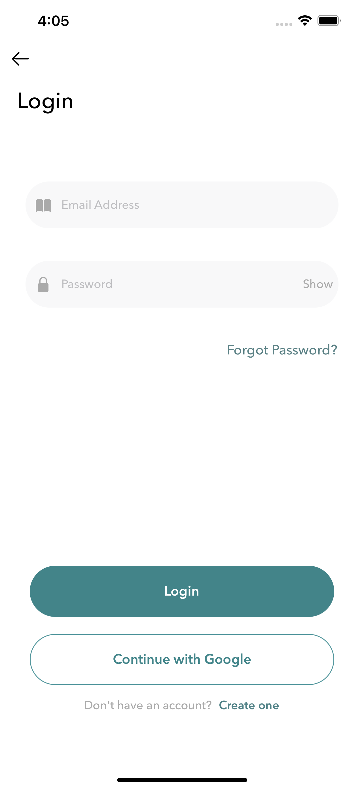

## Other Authentication Screens
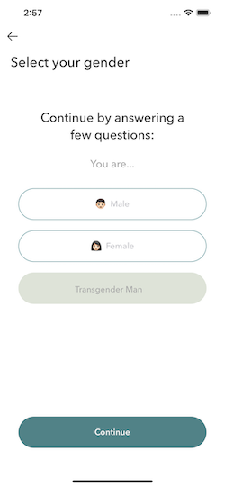
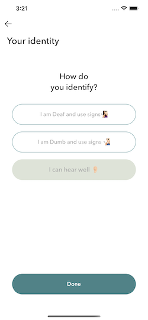
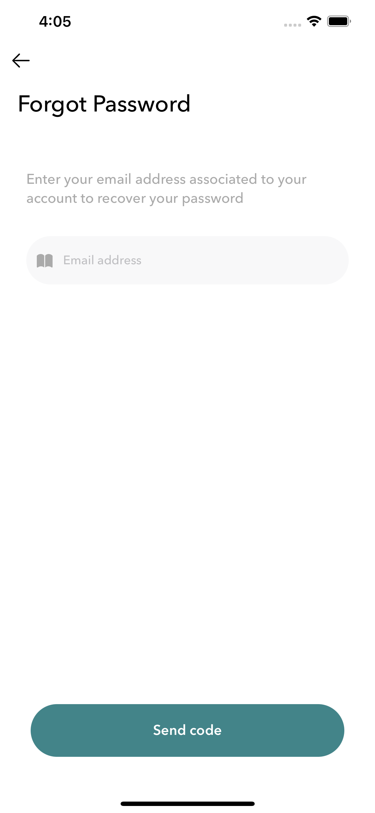

## Main App Screens
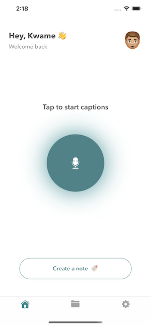
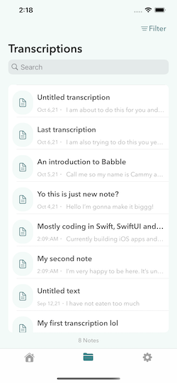
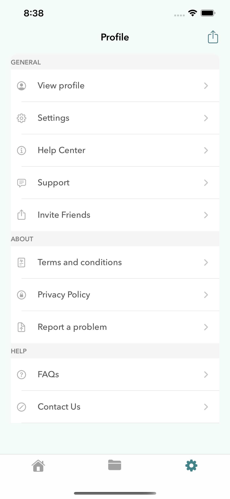

## Other Main App Screens
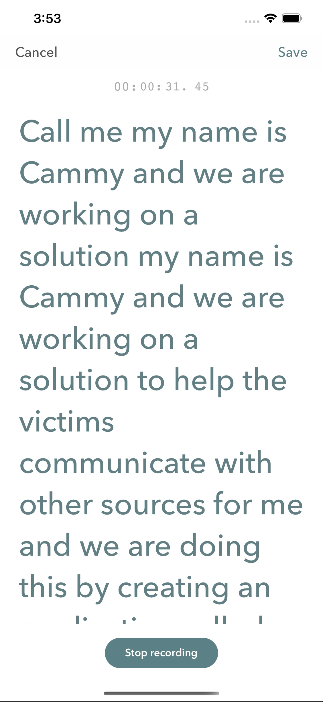
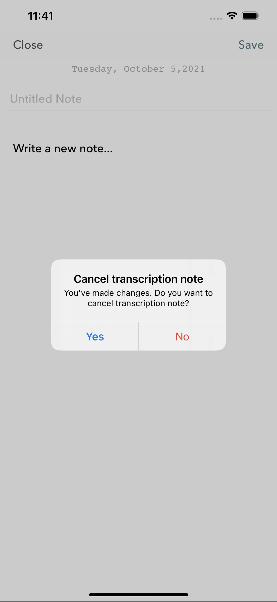
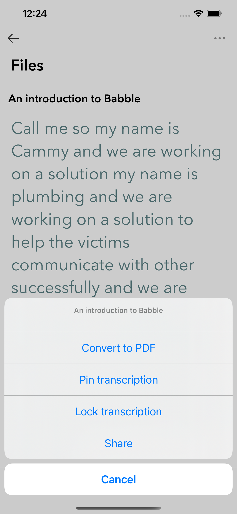

